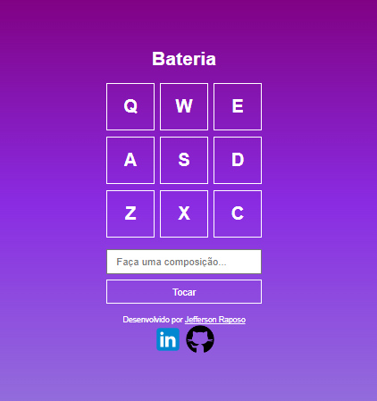
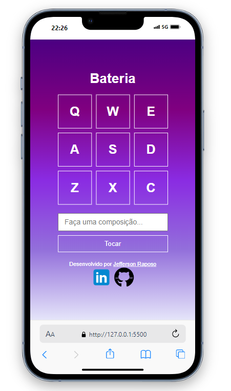

##
<h1 align="center">Projeto Calculadora com JavaScript</h1>

	

## 💻 Sobre o projeto

📄 Esse é um projeto de uma calculadora com foco no aprendizado das tecnologias HTML, CSS e JavaScript. 
 🔗 Acesse o projeto através do [link](https://raposo.dev.br/projects/js/bateria/) 
 🔗 https://raposo.dev.br/projects/js/bateria/

---

## 🎨 Layout

Abaixo segue layout do projeto.

### Web

  

### Mobile

  

---

## 🛠 Tecnologias

As seguintes ferramentas foram usadas na construção do projeto:

-   **HTML**
-   **CSS**
-   **JAVASCRIPT**

## 🧙‍♂️ Autor

Feito com ❤️ por Jefferson Raposo 👋🏽 [Entre em contato!](https://www.linkedin.com/in/jefferson-raposo/)

---